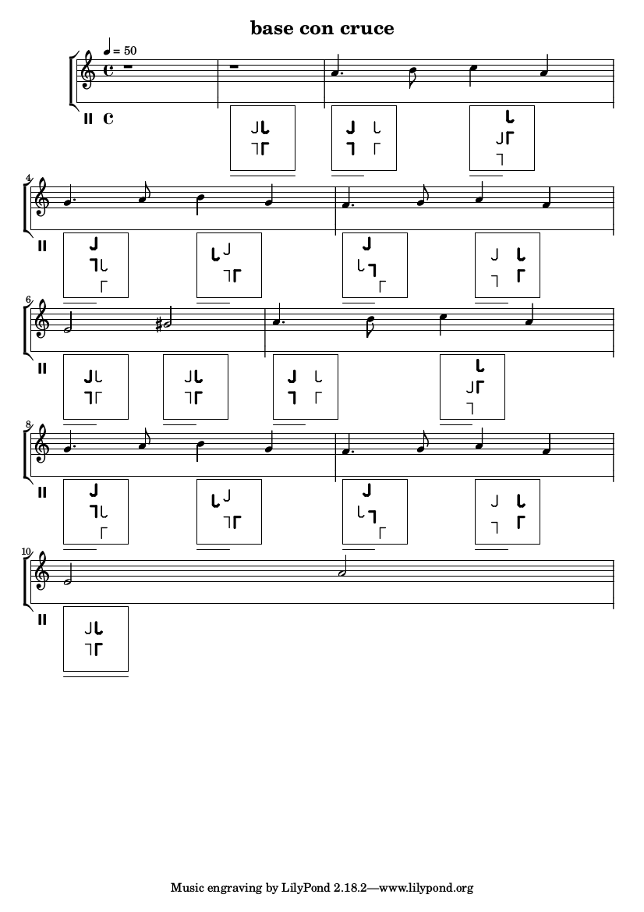

# Dance step notation in a music score


Some dancers including myself would like to have some means to memorize dance steps. 
There are quite a few suggestions for dance notation. [Manuel Bodirsky](http://www.lix.polytechnique.fr/~bodirsky/tango/notation.pdf) describes a rather concise system of symbols. He also gives an overview of other notations. [Thomas Rasche](http://www.tangonote.com/raschenotation/) uses keyboard characters. For me they both require some effort to learn before I can apply them easily, their level of abstraction is rather high. After learning them they can be written quite quickly. If you want you can easily apply the principles of this code to both of these notations. 

For me, a notation should be intuitively easy to understand, allow for describing the essential structure of a step and for some little extras
and it should be possible to associate the steps with the music. The burden is shifted from the reader to the author, if you want. This is how dance steps are generally presented to the broad public. 

Below is an easy example of such a notation. The step is taken from Tango Argentino and is called base con cruce, a basic step with a cross. 



# Requirements

The notation is based on Liypond. There is a lot of documentation, examples and templates, and a vivid and competent community. Download from http://lilypond.org and install as described there. Lilypond runs on Unix, Linux, FreeBSD, MAC OS X, and Windows. Editing is a lot easier if you also install Frescobaldi, an integrated development environment for Lilypond. Download from http://frescobaldi.org/ and install as described there. It also runs on Linux, MAC OS X and on Windows. 
Other than that there are no requirements.

On Ubuntu Linux (and probably on other Debian based Linux system, I didn't test this) installation is easy:
```
sudo apt-get install lilypond
sudo apt-get install frescobaldi
```

## Hello world
After installation, start frescobaldi, open the file Tango_Base_con_cruce.ly and press Ctrl+Shift+P (or click the lilypond icon). If everything is OK, you will see the above example to the right. 

# How to read the dance notation

The dance notation is somewhat analogous to the music notation. This means that it marks certain events in the dance, but in a discretized manner. It displays poses, i.e. positions and orientations of the four feet of the dance couple, the weight on the feet, and the association of the motion with the music.  

## Poses and motion

The diagram is like an image of the couple taken from above, showing only the feet. The feet of the leader are drawn with a 
corner, the feet of the follower look like walking sticks. See the initial diagram in bar 2 in the example above: the couple is standing face to face, the leader facing north, the follower facing south (the directions are like the ones of a usual map, north pointing to the top of the page, south to the bottom etc.). 

The leader has the weight on the right foot, the follower has the weight on the left foot. 
The weight on the foot corresponds to the thickness of the line.

Currently there are two weights, one (thick line) for the foot you are firmly standing on and one (thin line) for the foot that is ready to move.

There is a discrete number of positions for a foot in the diagram. Currently there are 10 positions from left to right (or west to east) and 10 positions from bottom to top (or south to north), 100 positions combined. There are eight directions for a foot, pointing north, north west, west, south west, south, south east, east, north east. Or, if you prefer the clock, pointing to 12, 10:30, 9, 7:30, 6, 4:30, 3, 1:30. Or, mathematically speaking and taking 0 degree to point to the right (west), the directions are, in degree, 90 , 135, 180, -135, -90, -45, 0, 45. 


In some dances the couple more or less stays on one spot (Salsa, Boogie, Rock 'n' Roll), whereas in others the couple moves along a line and sometimes takes a 90° turn (most ballroom dances, Tango Argentino).
For dances on the spot, a fixed window of the dance floor is OK. For the other dances, as the one in the example, we consider the square to be a window sliding over the dance floor as the couple moves along, but the window does not rotate. 

The feet that carry the weight in one pose can't be moved in the next step, so they remain where they are. On the dance floor, that is - since the window slides, the position in the window might change. The foot that gets the weight in the next pose might be at a new position and orientation (or not). What happens between these poses is the motion.  

## Rhythm 

This section is easier to read if you are somewhat familiar with music notation, but I'll try to explain some essentials as I go.  
In the music notation, the note corresponds to the moment when the tone first appears, and the duration of the note signfies how long it can be heard. For the notation of duration of a note, see e.g. https://en.wikipedia.org/wiki/List_of_musical_symbols. The event in the dance that corresponds to the onset of the tone is more or less when the weight is put on a foot. The duration of the note corresponds to the duration of the motion between two such events. However, the motion itself is implied like the tone that can be heard for the duration of the note. What is in the notation is the starting pose and the ending pose of one phase of the motion. The duration itself is marked below the square that contains the pose. A line from left to right corresponds to a whole note (see bar 2). The duration of a half note is expressed from left to the middle, a quarter note with a line starting left and going a quarter of the distance to the right end. For shorter durations the line lengths become difficult to distinguish. An eightth therefore is expressed with a short vertical line at the left side, a sixteenth with two vertical lines etc. As in musical notations, dots are used to express for example 3/4. 

## Abstraction

Poses and durations are discretetized. Of course in a real dance the poses and durations vary continuously, and a lot. But the quantization allow the reader to understand the situation at a glance, because the poses can be recognized more easily. We are taken a step from an overly detailed representation to a symbol. This leads to insight into the structure of the dance and of its connection with the music. 

# How to write dance notation

In Lilypond the user can define markups to the notes as graphics in Scheme. To be more precise, the dialect Guile (see https://en.wikipedia.org/wiki/GNU_Guile) is used. 

The tango pose is defined in a Guile function:

```
#(define-markup-command (tango-pose layout props pose-string)
  (string?)
  ...
  )
```

The pose diagrams are written in a special stave. Below is the pose in bar 2. The actual musical note in the stave
is the non printable (silent) break _s_, in this case _s1_. The digit _1_ after the letter _s_ denotes that the value is that of a whole note, it lasts an entire bar (of measure 4/4). It is used to align the tango poses with the music. The Tango pose is a markup to the silent break. The call argument of the markup function is a string (as declared above). 

```
tango = \relative c'' {
 \clef percussion
 s1
 s1_\markup \tango-pose #'"ll 5304 lr 6309 fl 6749 fr 5744 dur 1  " 
 ...
}
```

In detail the string is decoded into the pose and weight informations for the feet, and the duration of the pose. The duration is the number after the keyword _dur_. It needs to be identical with the duration code for the silent break _s_ .  The duration of _s_ determines the position in the music. The argument to the tango-pose function is interpreted for the graphics. 

The keywords for the feet are _ll_ for _leader, left foot_, _lr_ for _leader, right foot_, _fl_ for _follower, left foot_ and _fl_ for _follower, right foot_.  The keyword is followed by the valuse _xybw_, where _x_ is position left to right, _y_ is position bottom to top, _b_ (for _beta_) is orientation as described above, and _w_ is the weight. 
In the image above, the follower's right foot is shown, the arguments are _3655_.

Since I don't know Guile, nor have a good IDE, I haven't written a descent argument parser yet. Therefore, the argument string __MUST__ respect the positions of these arguments as given in the example, or the parser will crash. 


# Music

My examples will be dance steps along with Tango Argentino music. 
However, I don't have time to clarify the rights someone might hold for popular songs.
Therefore the music to the examples is written by the nerd himself (following  [Chris Mooney's guide](https://composerfocus.com/how-to-write-a-tango/)). The music examples are trivial on purpose so nobody can claim them.
If someone wants to contribute examples with known songs, please clarify the rights before suggesting. 
If you bring me the written consent of the rights owner, I may transscribe the song as time allows.


# Improvements

## More expressiveness

As time allows, I would like to add more options to express in the pose diagram. These include, but are not limited to, some Tango Argentino poses (there is quite a list in https://en.wikipedia.org/wiki/Figures_of_Argentine_tango). For a start, I would add gancho, voleo, colgada and barrida, than maybe planeo. 

Also, it might be interesting to indicate how high or low the dancers are standing and the shape of the embrace. On the other hand, these are largely implied by the pose, so in the interest of a concise representation that might gain the character of a symbol, maybe less detail is better. This needs to be tried out, I guess. 

## Better code

As mentioned before, I'm not good at Lisp or Scheme or Guile. Being unfamiliar with function definitions or procedure definitions, I produced a lot of bad copy-paste style code. This needs to be fixed.

Also I'm not at all happy with the arguments to the markup function, i.e. that this is a string where the user needs to stick precisely to the positions of the characters in the string. I'd like to change this, but I'm still uncertain which other method to provide the arguments would be most safe and easy to use.

## More examples

After the technical issues are improved, I'd like to turn to the real reason for doing all this and provide more songs along with the dance. 
The really interesting question is: what is in the music, and how does a couple best express their common feelings when listening to the music together by transfering them to motion. 

# Contact

For questions and comments write to the [nerd of the dance](mailto:nerdofthedance@protonmail.com).
